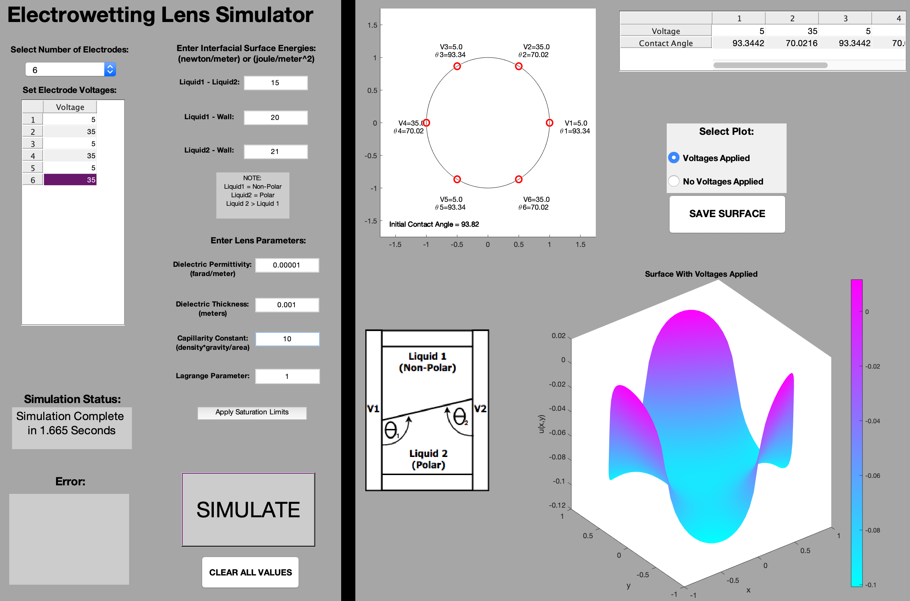

# EWL Sim
Steady state electrowetting lens simulator. Not suitable for dynamic simulations. Save function currently not working.

Simulates lenses with 1-20 electrodes using Young equation, Lippmann-Young equation, and capillary surface equation.

Requires image processing toolbox and partial differential equations toolbox. 

All files must be in the same folder. In MATLAB type command "EWLsim" to begin. 

See the screenshot below for example settings.

